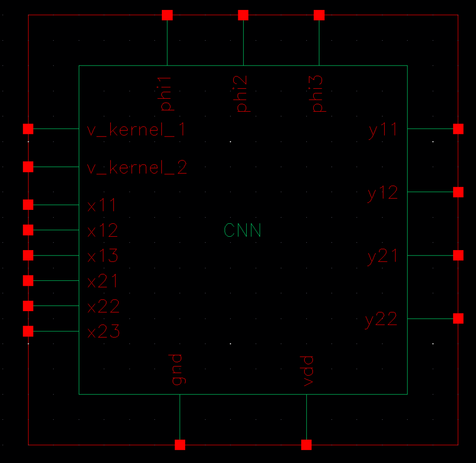
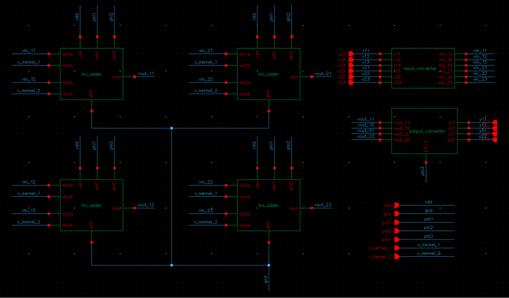
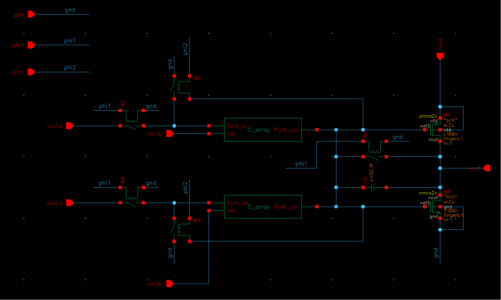
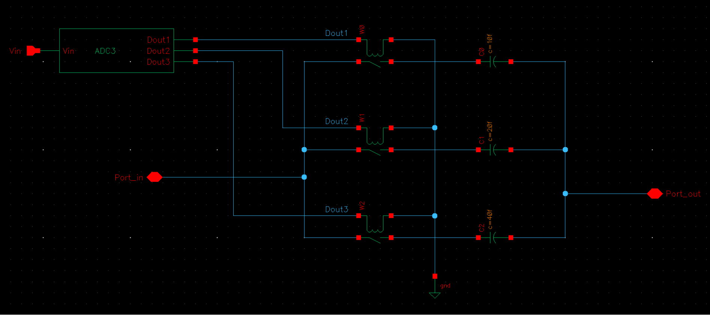
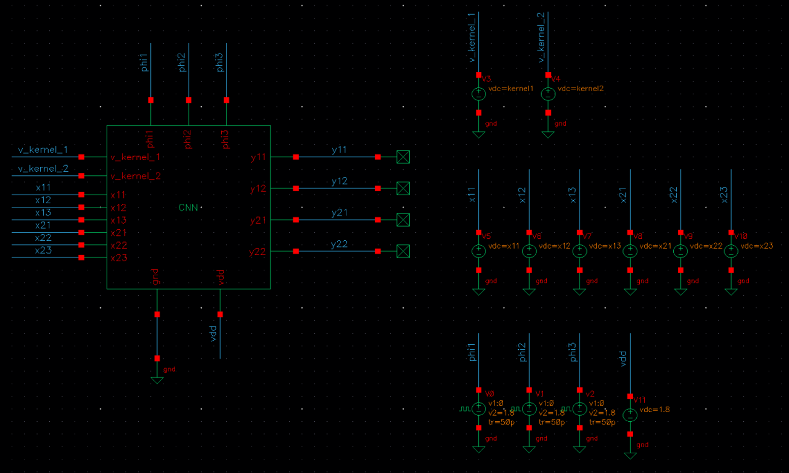

# Convolution Computation Based on Digital Inverters

This project implements an analog convolution computing circuit based on Cadence Virtuoso. Digital inverters are used as small-signal amplifiers, while switched-capacitor arrays perform multiplication and accumulation of input data and convolution-kernel weights. Ideal interface models are used to convert between digital values and analog voltages.

## Project Objectives

- Use digital inverters as the core amplifier elements.
- Perform analog convolution on a `2 x 3` input matrix using a `1 x 2` kernel.
- Provide digital input and digital output interfaces through input and sampled-output converters.
- Complete the convolution calculation within a single clock cycle while meeting accuracy and power requirements.

## System Architecture

The top-level `CNN` convolution module consists of:

1. **Input converter**: Scales external inputs `x11 ~ x23` to the `vin_11 ~ vin_23` signals required by the core circuit.
2. **Four `inv_adder` core units**: Compute the four output values `y11`, `y12`, `y21`, and `y22`.
3. **Output converter**: Uses the inverter common-mode reference to sample and hold the analog outputs and convert them into readable digital results.

```text
Input matrix:     x11 x12 x13
                  x21 x22 x23

Convolution kernel: k1  k2

Output matrix:    y11 y12
                  y21 y22
```

Each output is calculated from two adjacent input values and the two kernel weights.

## Circuit Diagrams

### Top-Level CNN Module



### System Architecture



### Inverter-Based Multiply-Accumulate Core



### Switched-Capacitor Weight Array



### CNN Testbench



## Interfaces and Key Parameters

### Input Converter

The external interface uses `1 V` to represent the digital value `1`. The input is scaled before entering the inverter core:

```text
vin_ij = 0.02 x x_ij
```

The resulting core input LSB is `20 mV`.

### Output Converter

The inverter common-mode reference is obtained by DC operating-point analysis, with:

```text
VAGND ≈ 0.747975 V
```

The output is measured relative to `VAGND`, with `2 mV` representing the digital value `1`:

```text
y = (Vout - VAGND) / 2 mV
```

The `phi3` clock samples and holds the output during the stable portion of the computation, reducing clock-switching glitches.

### Weight Control and Switched-Capacitor Array

- `ADC3` quantizes the kernel input into a 3-bit code.
- The binary-weighted capacitors are `10 fF`, `20 fF`, and `40 fF`.
- The equivalent capacitance is selected by the control code, enabling programmable kernel weights.
- The feedback capacitor is set to `C3 = 92.4 fF` to adjust the output voltage scale.

For example, when the weight input is `3 V`, the quantization code is `3`. The `10 fF` and `20 fF` branches are enabled, producing an equivalent capacitance of `30 fF`.

## Three-Phase Clocking

- `phi1`: active during the first half of the cycle for input sampling.
- `phi2`: active during the second half of the cycle for charge transfer and result settling.
- `phi3`: a narrow pulse during the stable portion of `phi2` for output sample-and-hold.

| Parameter | Setting |
| --- | --- |
| `phi1` / `phi2` period | `10 ns` |
| `phi1` high interval | `0 ~ 4 ns` |
| `phi2` high interval | `5 ~ 9 ns` |
| Non-overlap interval | Approximately `1 ns` |
| `phi3` delay / pulse width | `8 ns` / `0.5 ns` |
| Clock rise/fall time | `50 ps` |

## Simulation Results

For the main test case, the theoretical and simulated outputs are:

```text
Theoretical output:      8       13
                         23       28

Simulated output:      7.9975  12.9958
                      22.9914  27.9885
```

| Output | Accuracy |
| --- | ---: |
| `y11` | 99.969% |
| `y12` | 99.967% |
| `y21` | 99.963% |
| `y22` | 99.959% |

The average simulated supply current is approximately `0.528 mA`, below the `8 mA` requirement. The convolution unit completes its calculation within one `10 ns` clock cycle, and the sampled output waveform remains stable. Additional input matrices and kernels were also tested, with results consistent with the theoretical convolution values.

## Repository Structure

```text
.
├── README.md
├── docs/
│   └── images/           # Circuit diagrams used in this README
└── lab/
    ├── cds.lib
    ├── CNN_inv/          # Convolution core
    ├── CNN_inv_tb/       # Convolution-core testbench
    ├── inv_adder/        # Inverter-based multiply-accumulate unit
    ├── inv_adder_tb/     # Multiply-accumulate testbench
    ├── ADC3/             # 3-bit weight-control module
    ├── Ceff_ADC3/        # Equivalent-capacitance control module
    ├── Ceff_ADC3_tb/     # Equivalent-capacitance testbench
    ├── input_converter/  # Input converter
    └── output_converter/ # Sampled-output converter
```

## Simulation Environment

- Cadence Virtuoso
- Verilog-A
- Analog Design Environment / Maestro

Some files in this repository are Cadence design databases and simulation-generated files. Open the `lab/` directory in Cadence Virtuoso to inspect and simulate the design.
